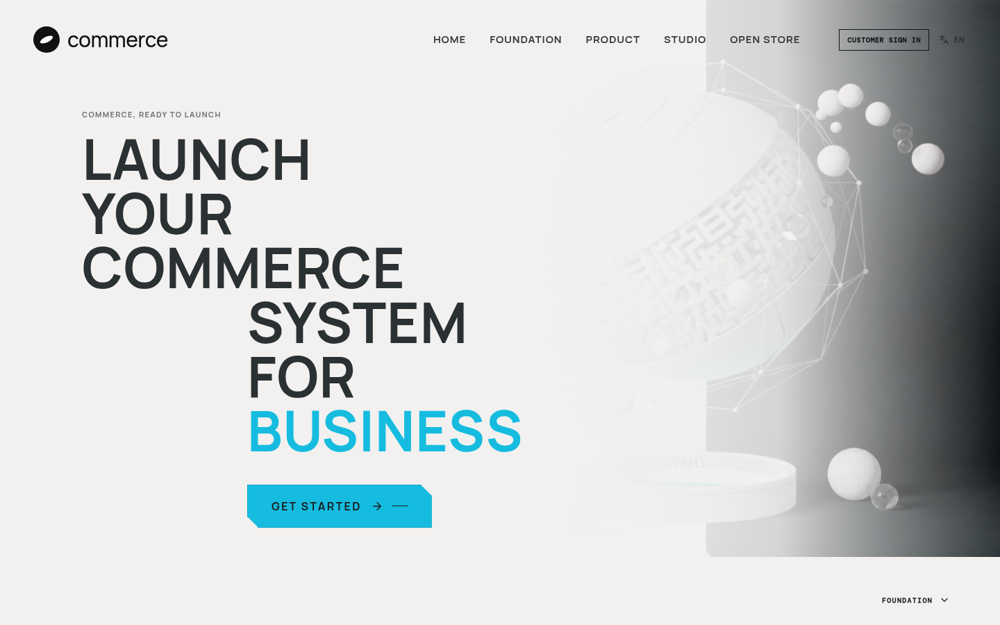

# Multi-tenant commerce platform

This repository contains a **merchant- and agency-oriented ecommerce platform** in the same broad product category as EverShop: a store owns its storefront configuration and commercial data, while its team uses a workspace to operate, preview, and publish it. The implementation is a TypeScript monolith with React, tRPC, Drizzle, and MySQL/TiDB.

> The product name is intentionally neutral until a final name is selected. The former “Office Hours”, Forge, and Rivet labels are not customer-facing product identity.

## Platform mockup



*A real desktop capture of the platform’s public landing experience, including its product positioning, navigation, storefront entry, and customer sign-in action.*

## What is implemented

| Area | Current capability |
|---|---|
| Tenant foundation | Workspaces, merchant-owned stores, memberships, and store-scoped products, carts, promotions, and orders. |
| Roles | **Owner / Manager** can publish, toggle extensions, and manage client reviews; **Merchandiser** can create and manage catalog products plus theme/sections; **Analyst** is read-only. Dashboard preference is available to every store member. |
| Storefront studio | Persisted Editorial, Studio, and Mono theme presets; section visibility controls; desktop and mobile composition preview; publication to `/s/:handle`. |
| Operations | Store-scoped catalog, product status, variant title/color/options/price/inventory/barcode editing, immutable stock movements, product-plan limit enforcement, merchant order review, cancellation, shipment tracking, cash settlement, returns, manual-review refunds, and image management. |
| Product media | Tenant-scoped product and variant images are stored in managed object storage with automatic 2000 px WebP conversion, source/optimized byte metadata, alt text, gallery/hover role, focal crop position, ordering, removal, and role-aware single or five-file bulk upload management. Product details use variant-aware media galleries and show the selected variant’s saved color and option values; catalog cards use hover media on desktop. |
| Algeria-first commerce | A shared provider-neutral capability registry seeds and governs merchant-owned native cash on delivery and bank transfer, delivery-zone/rate selection, immutable address/tax snapshots, merchant tax rules, customer profile creation, payment review, customer account linking, Mailjet-backed transactional order notifications with provider message outcomes, fulfilment and shipment records, returns, refunds, stock reservation, cancellation release, and settlement tracking. Chargily is a fail-closed optional adapter, not an active dependency. |
| Privacy operations | Signed-in customers can download their linked account data in-browser and submit a non-destructive erasure request. Platform administrators can record manual review outcomes; no customer or commercial record is deleted automatically. |
| Retention record | Owners and Managers can persist a store-scoped operational retention and recovery record, including policy/runbook references and a recovery-test date. It documents merchant decisions; it does not validate legal obligations, create backups, or restore data. |
| Search and reliability | Per-tenant sitemap output, `robots.txt`, runtime and commerce health endpoints, audit records, webhook event persistence, API request limiting, and webhook request limiting. |
| Agency handoff | Owner/Manager-created `SHARED` or `APPROVED` client-review links at `/review/:token`; they show the persisted active theme, visible storefront sections, and published catalog without merchant controls or checkout. |
| Localisation | English, French, and Arabic interfaces, including actual RTL direction for Arabic. |

## Primary journeys

```text
Merchant sign-in → /workspace → theme + sections + catalog → publish → /s/:handle
                                      │
                                      └→ create client review → /review/:token (read-only)

Customer → /s/:handle → cart → delivery + native payment choice → reviewable order
Merchant → /workspace → Commerce setup → delivery/tax/payment method controls → Orders → approve → ship → settle
```

`/s/store-1` is the seeded public tenant storefront. `/store` remains a legacy convenience route and is not the multi-store primary journey.

## Architecture

The detailed tenant model and product scope are maintained in [`platform_rebuild_architecture.md`](./platform_rebuild_architecture.md). The capability comparison and design rationale are in [`evershop_capability_audit.md`](./evershop_capability_audit.md).

Key implementation boundaries are:

| Concern | Implementation location |
|---|---|
| Schema and migrations | `drizzle/schema.ts`, `drizzle/0002_cynical_chamber.sql` through `drizzle/0009_normal_gravity.sql` |
| Tenant membership, studio, publication, handoff | `server/commerce/workspace.ts` |
| Catalog, cart, promotions, checkout, orders | `server/commerce/service.ts`, `server/commerce/commercial.ts` |
| Optional payment webhook / health / SEO | `server/commerce/webhooks.ts`, `server/commerce/health.ts`, `server/commerce/seo.ts` |
| Typed RPC surface | `server/commerce/router.ts`, `shared/commerce.ts` |
| Merchant workspace | `client/src/pages/MerchantWorkspace.tsx` |
| Tenant storefront / client review | `client/src/pages/PublicMerchantStore.tsx`, `client/src/pages/ClientReview.tsx` |

## Capability boundary

The platform has a production-minded **native Algeria-first commercial core**, but important provider-dependent boundaries remain explicit. It does **not** yet buy carrier labels or poll carrier tracking; its manual carrier record is an operational fallback. Chargily remains disabled until a merchant supplies their own credentials. New order notifications are dispatched through the configured Mailjet sender and marked `SENT` only after Mailjet accepts them. A separately token-protected Mailjet callback route is prepared, but no event callback is configured until publication; delivery, bounce, and complaint events are therefore not yet ingested. Customer sign-in uses the configured Auth0 regular web application through a server-side authorization-code and PKCE bridge; local merchant membership and tenant authorization remain platform-owned. No customer test account was created, so a voluntary first customer sign-in is still needed to validate the complete hosted redirect. Merchant subscription invoices are not yet connected to an external or platform-admin collection workflow. Privacy deletion is deliberately manual review only; the current app does not automate retention, anonymisation, database backup, or data restoration. See [`auth0_customer_auth_assessment.md`](./auth0_customer_auth_assessment.md), [`merchant_launch_readiness.md`](./merchant_launch_readiness.md), [`free_tier_integration_research.md`](./free_tier_integration_research.md), and [`privacy_retention_recovery.md`](./privacy_retention_recovery.md) for the operational boundaries. The studio remains a persisted theme-preset and section-visibility model, not a fully arbitrary drag-and-drop page builder.

## Development and validation

```bash
pnpm install
pnpm dev
pnpm check
pnpm test
```

The current automated suite covers domain policy, localisation, router guards, cart/order persistence, tenant isolation, role-specific operations, dashboard preference persistence, public client-review resolution, and tenant product-media authorization plus variant gallery hydration/fallback behavior. See [`validation_notes.md`](./validation_notes.md) for browser verification notes.

## Public-source release

This public repository includes the complete **React + Express + tRPC + Drizzle** application source, database schema and migrations, server routes, client interfaces, tests, CI workflow, architecture documentation, and visual media used by the public product experience. The included images and videos are under [`client/public/media`](./client/public/media), and the source uses these repository-local paths.

It deliberately excludes every production secret, customer/order record, database dump, active provider configuration, and private commit history. Supply your own database, Auth0 tenant, Mailjet sender, session keys, and optional merchant integrations before deploying.

### Local setup

```bash
pnpm install
cp .env.example .env
# Set the required values in .env. Never commit this file.
pnpm check
pnpm test
pnpm dev
```

Review [`PUBLIC_RELEASE.md`](./PUBLIC_RELEASE.md) for environment-variable requirements, database setup, release boundaries, and the included media manifest.

## Credits and acknowledgments

| Attribution | Role |
|---|---|
| [NourTi](https://github.com/NourTi) | **Product Developer & Platform Enhancer**; **UI Design & Display Presentation**. |
| [EverShop](https://github.com/evershopcommerce/evershop) community | Upstream open-source inspiration and category reference. This acknowledgment does not imply that EverShop or its maintainers contributed to, endorsed, or collaborated on this repository. |

See [`CONTRIBUTORS.md`](./CONTRIBUTORS.md) for the full attribution policy and future-contribution guidance.
